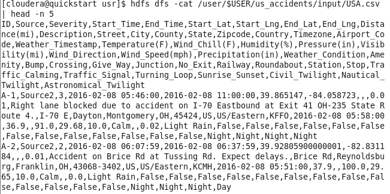
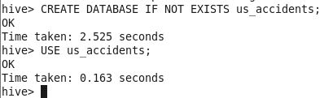
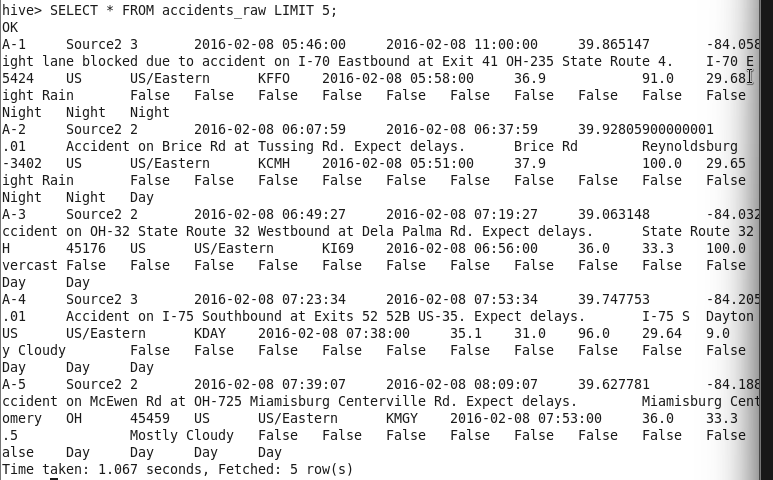
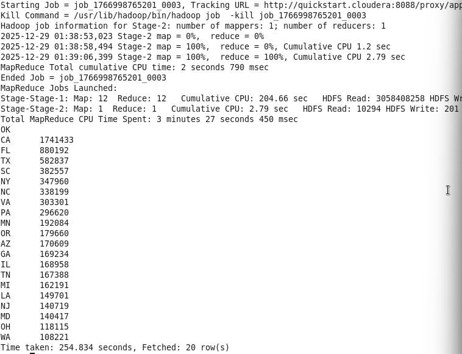
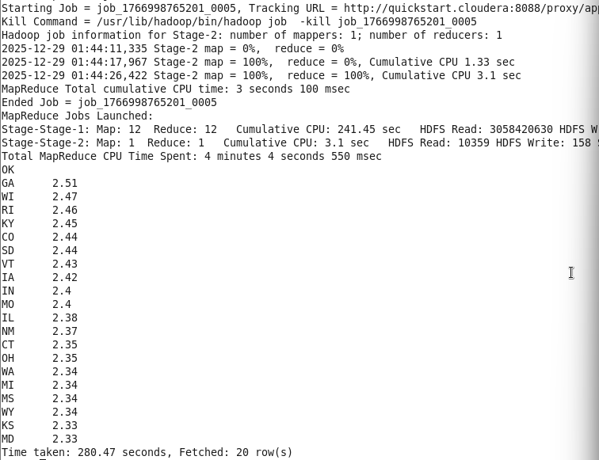
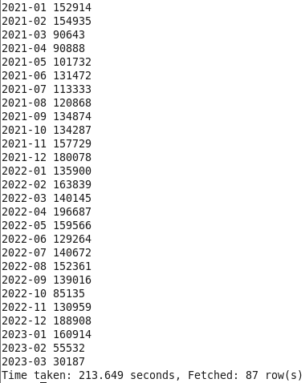
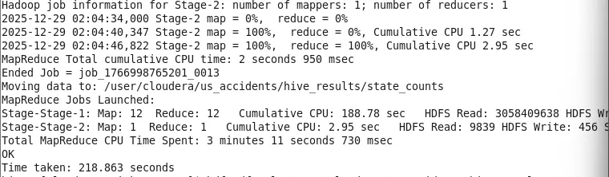
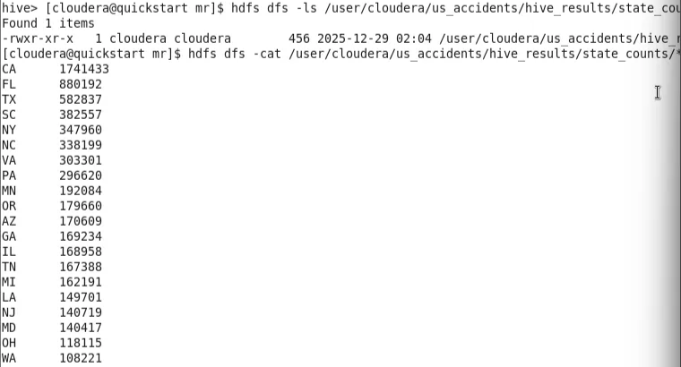

# Analyse Hive



```sql
CREATE DATABASE IFNOTEXISTS us_accidents;
USE us_accidents;
```



## 4.2 Créer la table Hive :

Ton dataset contient des champs texte (Description) avec des virgules, donc on évite `ROW FORMAT DELIMITED` simple. On utilise **OpenCSVSerde**, plus robuste pour les guillemets et virgules dans les champs.

```sql
DROPTABLE IFEXISTS accidents_raw;

CREATEEXTERNALTABLE accidents_raw (
  ID STRING,
  Source STRING,
  SeverityINT,
  Start_Time STRING,
  End_Time STRING,
  Start_LatDOUBLE,
  Start_LngDOUBLE,
  End_LatDOUBLE,
  End_LngDOUBLE,
  Distance_miDOUBLE,
  Description STRING,
  Street STRING,
  City STRING,
  County STRING,
  State STRING,
  Zipcode STRING,
  Country STRING,
  Timezone STRING,
  Airport_Code STRING,
  Weather_Timestamp STRING,
  Temperature_FDOUBLE,
  Wind_Chill_FDOUBLE,
  HumidityDOUBLE,
  PressureDOUBLE,
  VisibilityDOUBLE,
  Wind_Direction STRING,
  Wind_Speed_mphDOUBLE,
  PrecipitationDOUBLE,
  Weather_Condition STRING,
  AmenityBOOLEAN,
  BumpBOOLEAN,
  CrossingBOOLEAN,
  Give_WayBOOLEAN,
  JunctionBOOLEAN,
  No_ExitBOOLEAN,
  RailwayBOOLEAN,
  RoundaboutBOOLEAN,
  StationBOOLEAN,
  StopBOOLEAN,
  Traffic_CalmingBOOLEAN,
  Traffic_SignalBOOLEAN,
  Turning_LoopBOOLEAN,
  Sunrise_Sunset STRING,
  Civil_Twilight STRING,
  Nautical_Twilight STRING,
  Astronomical_Twilight STRING
)
ROW FORMAT SERDE'org.apache.hadoop.hive.serde2.OpenCSVSerde'
WITH SERDEPROPERTIES (
  "separatorChar"= ",",
  "quoteChar"= "\"",
  "escapeChar"    = "\\"
)
STORED AS TEXTFILE
LOCATION '/user/cloudera/us_accidents/input'
TBLPROPERTIES ("skip.header.line.count"="1");
```

Vérification rapide :

```sql
SELECT*FROM accidents_raw LIMIT5;
```



## 4.3 Requêtes analytiques (Hive)

### A) Nombre d’accidents par État (équivalent de ton MapReduce 1)

```sql
SELECT State,COUNT(*)AS nb_accidents
FROM accidents_raw
WHERE StateISNOT NULLAND State!=''
GROUPBY State
ORDERBY nb_accidentsDESC
LIMIT20;
```



### B) Gravité moyenne par État (équivalent de ton MapReduce 2)

```sql
SELECT State, ROUND(AVG(Severity),2)AS avg_severity
FROM accidents_raw
WHERE StateISNOT NULLAND State!=''
GROUPBY State
ORDERBY avg_severityDESC
LIMIT20;
```



### C) Accidents par mois (tendance temporelle)

Tes dates sont en format `YYYY-MM-DD HH:MM:SS`, donc on peut prendre les 7 premiers caractères `YYYY-MM`.

```sql
SELECT SUBSTR(Start_Time,1,7)AS year_month,COUNT(*)AS nb
FROM accidents_raw
WHERE Start_TimeISNOT NULLAND Start_Time!=''
GROUPBY SUBSTR(Start_Time,1,7)
ORDERBY year_month;
```



### D) Accidents par condition météo (top 20)

```sql
SELECT Weather_Condition,COUNT(*)AS nb
FROM accidents_raw
WHERE Weather_ConditionISNOT NULLAND Weather_Condition!=''
GROUPBY Weather_Condition
ORDERBY nbDESC
LIMIT20;
```


### E) Gravité moyenne par condition météo (top 20)

```sql
SELECT Weather_Condition, ROUND(AVG(Severity),2)AS avg_sev,COUNT(*)AS nb
FROM accidents_raw
WHERE Weather_ConditionISNOT NULLAND Weather_Condition!=''
GROUPBY Weather_Condition
HAVINGCOUNT(*)>=1000
ORDERBY avg_sevDESC
LIMIT20;
```


## 4.4 Sauvegarder les résultats (option livrable)

Exemple : exporter le top accidents par État vers HDFS.

```sql
INSERT OVERWRITE DIRECTORY'/user/cloudera/us_accidents/hive_results/state_counts'
ROW FORMAT DELIMITED FIELDS TERMINATEDBY'\t'
SELECT State,COUNT(*)AS nb_accidents
FROM accidents_raw
WHERE StateISNOT NULLAND State!=''
GROUPBY State
ORDERBY nb_accidentsDESC;
```



Puis côté shell :

```bash
hdfs dfs -ls /user/cloudera/us_accidents/hive_results/state_counts
hdfs dfs -cat /user/cloudera/us_accidents/hive_results/state_counts/*
```

